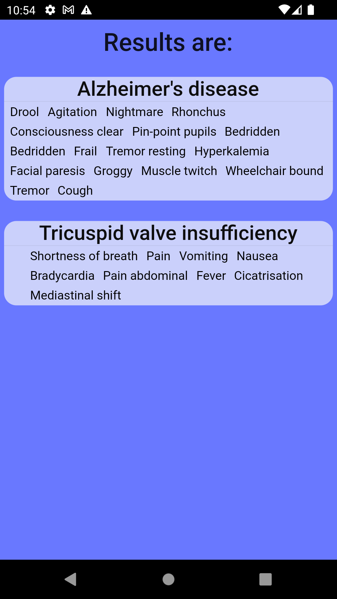

# Diagnose: Symptoms checker

Diagnose is cross platform mobile application written in Flutter.
The aim of this project is to assist doctors or anyone in those related field to find disease that includes set of symptoms.

## Data Sources

Data sources of my Symptoms and Diseases I have taken from another project: [Lab: DHILab Medical Symptom Checker
](https://github.com/LabinatorSolutions/medical-symptom-checker)
they were dataset of .jsx files I turned them into JSON type.
You can find them at:

- **assets/data/Diseases.json**
- **Symptoms.json**

## IMPORTANT
this is unfnished project! I haven't completely finished the project yet.
There are some bugs left at:
- **lib/results.dart**

In near future I will fix the last part of the application and publish a complete version of the app with better design and a cleaner code.

## Pictures

